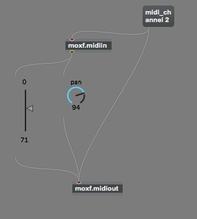
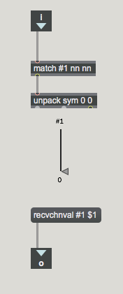

# moxf_external

Allow Ableton Max4Live Control from Yamaha's MOXF class of keyboards

> I've only developed this on Mac OS X - so this only apples to Mac - One day I'll have a look at Windows

## background

The MOXF uses 5 MIDI ports in total. Of these ports

* Port 1 is used for MIDI notes and SysEx and Bulk Dump
* Port 4 is used for VST Editor

This Max external will utilise both of these ports to achieve its objectives.

## overview

There are two max externals
* moxf.midiin
* moxf.midiout

"moxf.midiin" will emit messages in the following form if and only if the incoming MIDI message matches the configured midi channel

```
param_name midi_channel value

e.g.
volume 2 67
```
These messages are received on Port 4 of the MOXF's USB MIDI Interface

"moxf.midiout" will emit a message on the configured midi channel when it receives a message in the form

```
recvchnval param_name value

e.g.
recvchnval volume 43
```

## usage

Typical usage takes the following form:
1) add both externals to a patch
2) configure midi channel attribute by sending a "midi_channel" attribute
3) connect the output to a slider, dial etc
4) connect the output from the slider to the output external

This can be seen in the following patcher diagram




Note: The dial and slider are subpatchers inserted into the patch using the "bpatcher" object.

E.g.



The JSON text version of these sub patchers are available in the resources subfolder of this repository.

